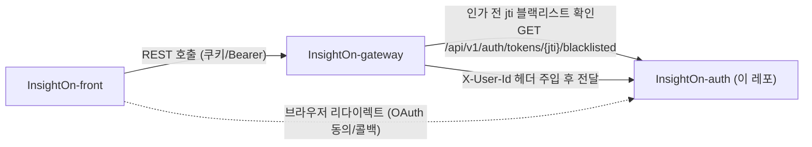
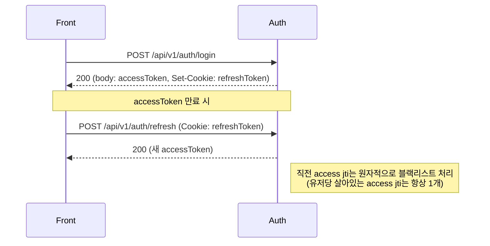
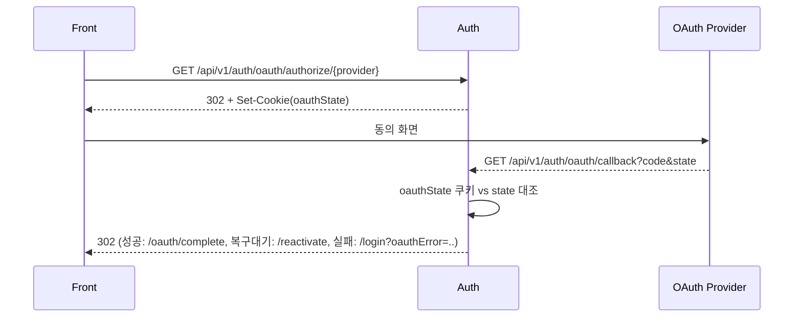

# InsightOn Auth

InsightOn 프로젝트의 인증/사용자 관리 서버. 회원가입, 로그인(일반/소셜), 토큰 발급·재발급·블랙리스트, 마이페이지, 관리자 회원 관리를 담당한다.

## 기술 스택

- Java 21, Spring Boot 3.5
- Spring Web, Spring Security (JWT 기반, 세션 미사용)
- Spring Data JPA (PostgreSQL / 로컬은 H2)
- Redis, Redisson
- Spring Cloud OpenFeign + Resilience4j (서킷브레이커)
- Spring Mail (Brevo SMTP)
- springdoc-openapi (Swagger UI)
- Micrometer + Zipkin, Prometheus

## 실행

```bash
./mvnw spring-boot:run -Dspring-boot.run.profiles=dev
```

로컬 기본 포트는 `8000`. 필요한 환경변수는 프로젝트 루트 `.env`(git에는 없음, 직접 발급받아 배치)에 다음 키들로 채운다.

| 키 | 용도 |
|---|---|
| `DB_URL`, `DB_USERNAME`, `DB_PASSWORD` | PostgreSQL 접속 정보 (dev 프로필) |
| `REDIS_HOST`, `REDIS_PORT`, `REDIS_PASSWORD`, `REDIS_DATABASE` | Redis 접속 정보 |
| `JWT_PRIVATE_KEY`, `JWT_PUBLIC_KEY` | 액세스/리프레시 토큰 서명용 키 쌍 |
| `BREVO_SMTP_LOGIN`, `BREVO_SMTP_KEY` | 이메일 인증·비밀번호 재설정 메일 발송 |
| `GOOGLE_CLIENT_ID`, `GOOGLE_CLIENT_SECRET` | 구글 소셜 로그인 |
| `GITHUB_CLIENT_ID`, `GITHUB_CLIENT_SECRET` | 깃허브 소셜 로그인 |

프로필별 세부 설정은 `src/main/resources/application-{dev,prod}.properties`와 그 아래 `config/{dev,prod}/*.properties`에서 관리한다.

## API 문서

앱 실행 후 아래에서 확인한다.

- Swagger UI: `http://localhost:8000/swagger-ui/index.html`
- OpenAPI 스펙(JSON): `http://localhost:8000/v3/api-docs`

컨트롤러(`controller/api`)와 Swagger 문서 어노테이션(`controller/swagger`)이 인터페이스로 분리돼 있다. 새 엔드포인트를 추가할 땐 대응하는 `*Api` 인터페이스에 `@Operation`/`@ApiResponse`/`@Parameter`를 채우고 컨트롤러에서 `implements` + `@Override`만 붙이면 된다.

## 주요 엔드포인트

| 영역 | 베이스 경로 | 설명 |
|---|---|---|
| Auth | `/api/v1/auth` | 회원가입, 이메일 인증, 로그인/로그아웃, 소셜 로그인, 토큰 재발급 |
| Account | `/api/v1/auth` | 이메일/비밀번호 찾기, 탈퇴 계정 재활성화 |
| Admin | `/api/v1/admin` | 관리자 로그인, 회원 조회/차단/휴면/활성화/권한 변경/강제 로그아웃 |
| Mypage | `/api/v1/users` | 내 정보 조회/수정, 비밀번호 변경, 소셜 계정 연동 관리, 탈퇴 |
| Token | `/api/v1/auth/tokens/{jti}/blacklisted` | 게이트웨이가 호출하는 액세스 토큰 블랙리스트 조회 |
| Core | `/internal/v1/users` | 내부 서비스(core 등)가 호출하는 사용자 조회 |

## 서비스 아키텍처 개요

InsightOn은 여러 서비스로 나뉘어 있고, 이 레포는 그중 auth다. 아래는 front/gateway와의 관계만 정리한 것이다.



- **gateway → auth**: 요청마다 액세스 토큰의 jti가 블랙리스트에 있는지 먼저 확인하고, 인증된 요청에는 `X-User-Id` 헤더를 실어 보낸다. 컨트롤러들이 `@RequestHeader("X-User-Id")`로 이 값을 신뢰해서 쓴다.
- **front ↔ auth**: 일반 로그인/토큰 재발급은 REST, 소셜 로그인·마이페이지 연동은 브라우저 리다이렉트 왕복(302)으로 처리한다.

## 주요 흐름

### 일반 로그인 + 토큰 재발급



### 브라우저 주도 소셜 로그인/연동



## 브랜치 전략 & CI/CD

- 브랜치는 `dev`에서 파서 `<type>/<설명>` 형식으로 만든다 — `feature/`, `fix/`, `refactor/`, `test/` (예: `fix/access-token-revocation`, `refactor/admin-role-update`).
- 작업 단위로 PR을 올려 `dev`에 병합하고, `dev`가 안정화되면 `main`으로 승격한다.
- `.github/workflows/deploy.yml`이 `main`/`dev-deploy`/`dev` 브랜치의 push·PR마다 실행되며, 실제 빌드/배포 단계는 `InsightOn-infra` 레포의 공용 재사용 워크플로우(`auth-ci-cd.yml`)에 위임한다.

## 테스트

```bash
./mvnw test
```
